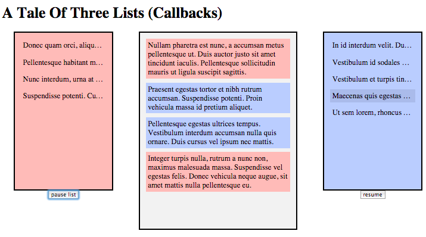

# A Tale Of Three Lists

A sorta-sophisticated but still silly async events processing demo.

The demo simulates a feed of data that's sampled at different speeds, filtered into two lists (red and blue). You can select an item from either list and it's added to your saved list in the middle. Selected duplicates are marked off and then removed.

## Why

The goal of this project is to sort of be the [TodoMVC](http://todomvc.com/) of async programming. I've seeded the repo with 7 implementations of the same demo, each using a different async pattern.

The code is organized in such a way that there's as much overlap between the implementations as possible. This is intentional. It helps reduce the noise of difference, so that you can focus on only the important things: **the different strengths and weaknesses of each async pattern.**

I invite all visitors to study the code and do side-by-side comparisons between the different implementations, to see those pros/cons for yourself.

I will also be adding more detailed write-ups of these differences over time, as well as new implementations if there are significant (not just trivial syntax sugar) differences to be illustrated. Suggestions are welcomed!

## Compared Patterns

The following patterns are currently implemented for inspection/comparison:

* [Plain Callbacks](/../../tree/master/callback/): the old-school tried-and-true callback
* [Thunks](/../../tree/master/thunk/): thunks are using closure to make a function into an async-capable container for future values (like a promise without the API)
* [Promises](/../../tree/master/promise/): using only bare ES6 promises
* [Promises+Generators](/../../tree/master/promise-generator/): combining promises & generators, assisted by [asynquence](http://github.com/getify/asynquence)'s generator processing.
* [asynquence Flavored](/../../tree/master/asynquence/): adding in the spice and flavor that [asynquence](http://github.com/getify/asynquence) brings to async programming.
* [Reactive Sequences (Observables)](/../../tree/master/reactive-sequence/): showing [asynquence](http://github.com/getify/asynquence)'s flavor of observables, called "reactive sequences".
* [CSP](/../../tree/master/csp/): showing [asynquence](http://github.com/getify/asynquence)'s emulation of [CSP](https://github.com/getify/asynquence/tree/master/contrib#go-style-csp-api-emulation) (channel-based concurrency).

## Not A UI/Framework Bikeshed

I use simple jQuery and CSS for the UI of this demo. I don't want that to change. This project is not about comparing different frameworks' approaches to managing and rendering the UI.

That'd be a fun project [for you to fork](/../../fork) off this one, and compare Angular, React, Backbone, Ember, etc for the UI processing of the lists, kinda like TodoMVC does.

But this project is about exploring the relative merits and shortcomings of each async pattern approach. Any other differences would be unnecessary distracting noise.

## License

The code and all the documentation are released under the MIT license.

http://getify.mit-license.org/
